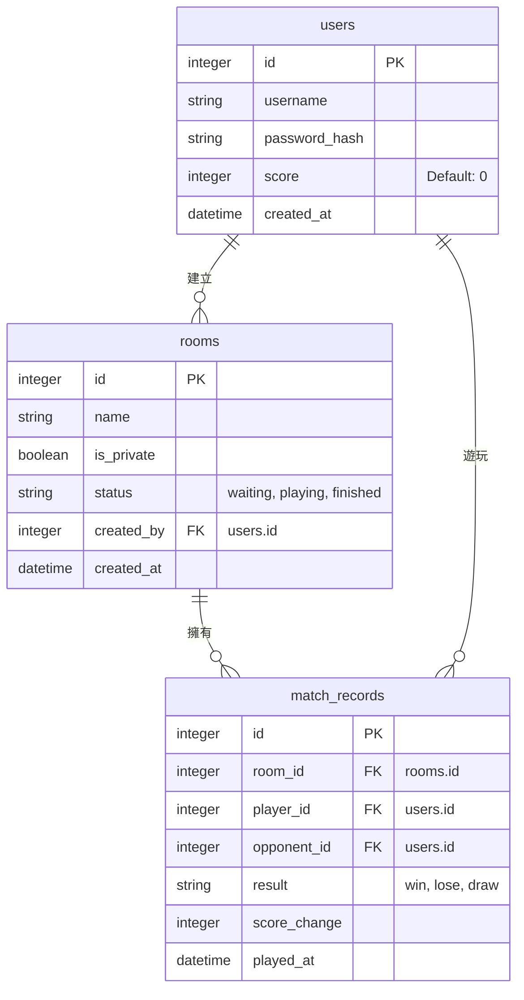

# 資料庫設計文件 (DB_DESIGN)

本文件依據 PRD 與架構設計，定義系統所需的實體關係與建表語法。本專案將採用 SQLAlchemy 結合 SQLite 做為主要存放方案。

## 1. 實體關係圖 (ER Diagram)

## 2. 資料表詳細說明

### `users` 資料表
儲存使用者帳號與整體積分。
- `id` (INTEGER): 主鍵，自動遞增。
- `username` (VARCHAR): 使用者名稱，必填且唯一。
- `password_hash` (VARCHAR): 加密後的密碼字串。
- `score` (INTEGER): 使用者的總積分，用於排行榜與歷史結算。預設為 `0`。
- `created_at` (DATETIME): 帳號建立時間。

### `rooms` 資料表
儲存建立的遊戲房間。
- `id` (INTEGER): 主鍵，自動遞增。
- `name` (VARCHAR): 房間名稱（可為自訂名稱）。
- `is_private` (BOOLEAN): 判斷是否為私人房間（不顯示在公開配對大廳中）。預設 `False`。
- `status` (VARCHAR): 房間當前狀態。可為 `waiting`（等待中）、`playing`（遊戲中）、`finished`（結束）。預設 `waiting`。
- `created_by` (INTEGER): 創建者的使用者 ID（關聯 `users.id`）。
- `created_at` (DATETIME): 房間建立時間。

### `match_records` 資料表
儲存每局對戰後的成績結算紀錄，方便回首歷史戰績與計算個人勝率。
- `id` (INTEGER): 主鍵，自動遞增。
- `room_id` (INTEGER): 關聯該次遊戲發生的房間 ID（關聯 `rooms.id`）。
- `player_id` (INTEGER): 主視角的玩家 ID（關聯 `users.id`）。
- `opponent_id` (INTEGER): 對手玩家 ID（關聯 `users.id`，若支援多人未來可改為其他機制）。
- `result` (VARCHAR): 遊戲結果，可為 `win`（勝）、`lose`（敗）、`draw`（平手）。
- `score_change` (INTEGER): 該場遊戲玩家減少或增加的積分變動值。
- `played_at` (DATETIME): 比賽遊玩結束/紀錄產生的時間。

## 3. SQL 建表語法
相關的原始建表語法，已輸出至 `database/schema.sql`，也可以由 SQLAlchemy 自動建立。
