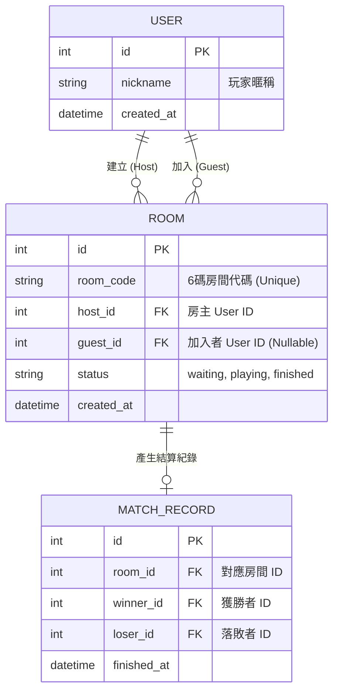

# 資料庫設計文件 (DB_DESIGN)

本文件基於 PRD 與流程圖的需求，規劃「線上撲克牌桌遊網站」的資料庫結構。我們採用 SQLite 與 SQLAlchemy ORM。

---

## 1. ER 圖（實體關係圖）

---

## 2. 資料表詳細說明

### 2.1 USERS (使用者表)
儲存玩家的基本資料，為免註冊系統，每次使用者進入系統時可建立一個暫時暱稱。
- `id` (INTEGER): Primary Key，自動遞增。
- `nickname` (TEXT): 必填，玩家選擇的顯示名稱。
- `created_at` (DATETIME): 建立時間，預設為當下。

### 2.2 ROOMS (遊戲房間表)
負責記錄當下開局的房間狀態、人數與加入成員。
- `id` (INTEGER): Primary Key，自動遞增。
- `room_code` (TEXT): 必填且唯一，供玩家輸入加入的 6 碼代號。
- `host_id` (INTEGER): Foreign Key (USERS.id)，必填，建立房間的房主。
- `guest_id` (INTEGER): Foreign Key (USERS.id)，選填，加入房間的對手玩家。
- `status` (TEXT): 房間狀態，預設為 `'waiting'`，可變更為 `'playing'` 或 `'finished'`。
- `created_at` (DATETIME): 建立時間。

### 2.3 MATCH_RECORDS (對戰紀錄表)
當遊戲結束時，寫入此表以產生結算結果與歷史戰績。
- `id` (INTEGER): Primary Key，自動遞增。
- `room_id` (INTEGER): Foreign Key (ROOMS.id)，對應的房間。
- `winner_id` (INTEGER): Foreign Key (USERS.id)，獲勝者。
- `loser_id` (INTEGER): Foreign Key (USERS.id)，落敗者。
- `finished_at` (DATETIME): 對戰結束時間。
