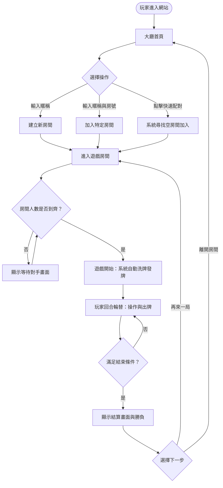
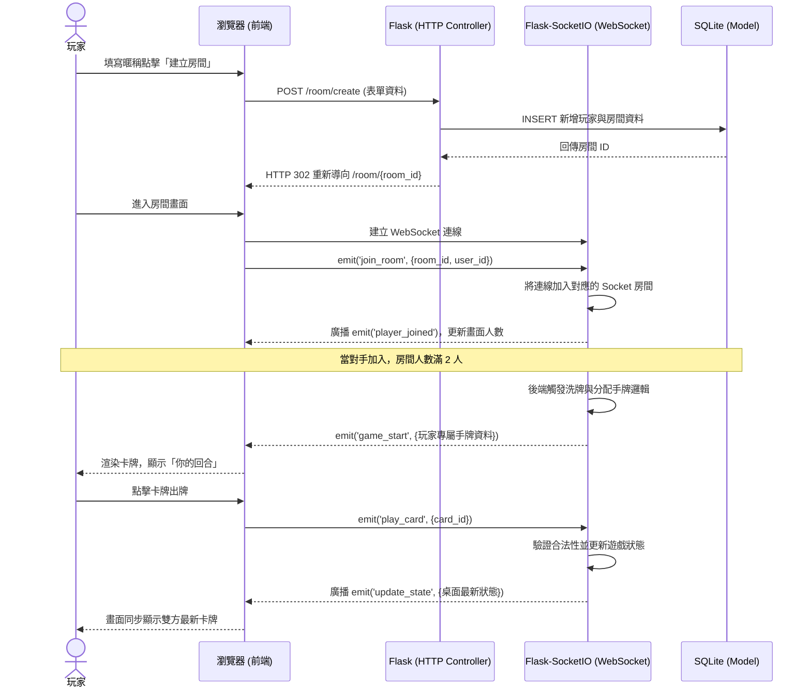

# 系統流程圖與使用者流程 (FLOWCHART)

本文件基於 `docs/PRD.md` 的需求與 `docs/ARCHITECTURE.md` 的技術架構，定義出「線上撲克牌桌遊網站」的使用者操作路徑與系統資料流。

---

## 1. 使用者流程圖 (User Flow)

這張圖描述了玩家從進入網站到完成一局遊戲的完整操作路徑。

---

## 2. 系統序列圖 (Sequence Diagram)

這張圖描述了「玩家建立/加入房間」到「系統發牌與即時對戰」背後的技術實作流程，包含傳統 HTTP 請求與 WebSocket 的交替使用。

---

## 3. 功能清單對照表

此表列出了主要功能所對應的 URL 路徑、通訊協定與方法：

| 功能名稱 | URL 路徑 / Event 名稱 | 協定與方法 | 說明 |
| :--- | :--- | :--- | :--- |
| **進入首頁大廳** | `/` | HTTP `GET` | 顯示輸入暱稱與選擇操作的介面。 |
| **建立房間** | `/room/create` | HTTP `POST` | 接收暱稱，在資料庫建立房間後重新導向至房間頁面。 |
| **加入房間** | `/room/<room_id>` | HTTP `GET` | 進入特定的遊戲房間畫面並載入基本前端資源。 |
| **加入即時連線** | `join_room` | WS `emit` | 前端建立連線後，主動告知後端將自己加入該 Socket 房間。 |
| **開始遊戲與發牌** | `game_start` | WS `broadcast` | 當人數到齊，後端自動洗牌並推播各自的手牌給對應玩家。 |
| **玩家出牌** | `play_card` | WS `emit` | 玩家進行遊戲操作時，傳送出牌動作給後端。 |
| **更新遊戲狀態** | `update_state` | WS `broadcast` | 後端驗證出牌後，將最新牌桌資訊與當前輪替玩家推播給所有人。 |
| **遊戲結算** | `game_over` | WS `broadcast` | 達成勝利條件時推播結果，前端渲染勝負結算畫面。 |
