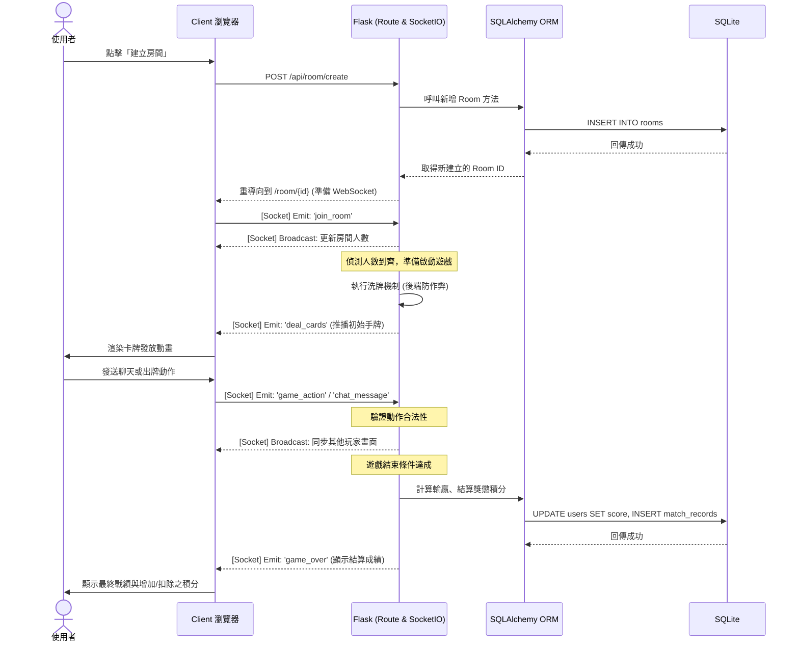

# 流程圖文件 (FLOWCHART) - 線上桌遊系統

這份文件基於 `docs/PRD.md` 與 `docs/ARCHITECTURE.md` 產出，以視覺化的方式展示使用者的操作路徑與系統內的資料流動。

## 1. 使用者流程圖 (User Flow)

此圖展示了使用者從進入網站開始，能夠執行的各種主要功能與頁面間的跳轉。

```mermaid
flowchart LR
    A([使用者開啟首頁]) --> B{是否已登入？}
    B -->|否| C[登入/註冊頁面]
    C -->|送出表單| B
    B -->|是| D[遊戲大廳 (Main Lobby)]
    
    D --> E{選擇操作}
    
    E -->|查看個人戰績與排行榜| F[歷史紀錄與排行榜頁面]
    F --> D
    
    E -->|建立新房間| G[建立私人/公開房間]
    E -->|隨機配對| H[隨機配對系統]
    
    G --> I[等待其他玩家加入]
    H --> I
    
    I -->|人數湊齊| J[進入遊戲桌 (轉往遊戲畫面)]
    
    J --> K{遊戲進行中}
    K -->|透過對話框| L[即時聊天互動]
    L --> K
    K -->|系統自動觸發| M[核心系統：自動發牌]
    M --> K
    K -->|玩家換手回合| N[狀態同步與出牌動作]
    N --> K
    
    N -->|達到結束條件| O[遊戲結束：勝敗判定]
    O --> P[獎懲結算 (更新顯示積分)]
    P --> D
```

## 2. 系統序列圖 (Sequence Diagram)

此處描述系統中最核心場景：「建立房間/配對 -> 遊戲進行與發牌 -> 遊戲結束與寫入成績」的完整內部資料流動。



## 3. 功能清單對照表

本表列出主要功能及其對應的 URL 路徑、HTTP 方法與 Socket 事件：

| 功能項目 | 通訊協定/類型 | URL 路徑 / Socket 事件 | 處理方式與對應邏輯 |
| --- | --- | --- | --- |
| 註冊帳號 | HTTP POST | `/auth/register` | Flask Route 處理密碼加密並寫入 User 資料表 |
| 使用者登入 | HTTP POST | `/auth/login` | Flask Route 驗證密碼並建立 Session |
| 遊戲大廳頁面 | HTTP GET | `/lobby` | 渲染 `lobby.html`，取得並顯示目前公開房間清單 |
| 個人戰績與排行 | HTTP GET | `/leaderboard` | 查詢成績並渲染排行榜畫面 |
| 建立房間 API | HTTP POST | `/api/room/create` | 寫入房間紀錄，回傳 Room ID 供跳轉 |
| 進入遊戲桌面 | HTTP GET | `/room/<room_id>` | 渲染 `game.html` 介面，載入 WebSocket 用戶端腳本 |
| 即時聊天室 | WebSocket | Event: `chat_message` | 將玩家文字廣播給該房間 (`room_id`) 內的所有用戶 |
| 接收發牌資訊 | WebSocket | Event: `deal_cards` | 遊戲啟動時，由後端運算洗牌並對各玩家發送專屬牌組 |
| 遊戲內出牌動作 | WebSocket | Event: `player_action` | 玩家送出動作，由後端伺服器驗證合法性並推播狀態更新 |
| 勝負獎懲結算 | WebSocket | Event: `game_over` | 廣播勝負結果，後端同步寫入 DB 更新雙方積分與戰績 |
